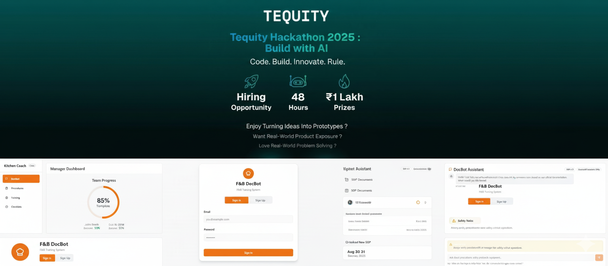

<br>

# FnB-DocBot

A smart food and beverages bot that uses SOPs/policies to give response on user query and gives managers to the get dashboard access for completion, competency, and adherence.

## Problem Statement

Design and prototype an internal-facing digital training solution—centered on a Document Intelligence Bot (docbot)—that:

- Converts existing SOPs/policies into just-in-time, stepwise guidance (e.g., “Deep fryer safety: step 1… step 2…”).
- Delivers microlearning (short lessons + quizzes), supports spaced repetition, and tracks progress & compliance.
- Gives managers dashboards for completion, competency, and adherence (audit-ready).
- Works on low-friction devices used in F&B (shared tablets, kiosk mode, mobile BYOD).

## 🚀 Features

- **Docbot Chat** that only answers from provided SOPs/policies (no hallucinations; must show citations).
- **Procedure Mode** (step-by-step, with checkboxes and “show me how” snippets/images if available).
- **Quiz Engine** (MCQ/true-false) + spaced repetition (e.g., Leitner).
- **Manager Dashboard** with: completion %, average score, last trained date, checklist adherence.
- **User roles** (Crew vs Manager) and basic auth (okta/email+otp/mock SSO acceptable).
- **Content versioning**: responses display “SOP vX.Y, date”.

## 🛠️ Tech Stack

- **Frontend**: ReactJs
- **Backend**: Appwrite and Python with FastAPI
- **Vector Search**: faiss
- **Authentication**: Appwrite Auth
- **AI Integration**: Groq AI
- **Development**: uvicorn for hot reloading

## 📋 Prerequisites

- Python
- Groq API Key

## ⚙️ Installation

1. **Clone the repository**

   ```bash
   git clone <repository-url>
   cd backend
   ```

2. **Install dependencies**

   ```bash
   python3 -m venv ./venv
   ```

   ```bash
   source venv/Scripts/activate
   ```

   ```bash
   pip install --no-cache-dir -r ./requirements.txt
   ```

3. **Environment Setup**
   Create a `.env` file in the root directory with the following variables:

   ```env
   # AI (Groq)
   GROK_API_KEY=your_groq_api_key
   ```

## 🚀 Running the Application

1. **Start the main server**

   ```bash
   uvicorn run main:app --reload
   ```

2. **Start the frotend application**

   ```bash
   npm run dev
   ```

## 📝 API Endpoints

### Response

- `POST /api/inngest` - upload a new file
- `GET /api/query` - query to get response

## 🔄 Response Processing Flow

1. **Response Creation**

   - User submits a file and a group of file
   - System creates a temp file

2. **RAG Processing**

   - Inngest triggers and creates vector embeddings based on that temp file
   - Then Query triggers it also creates vector embeddings 
   - And then perform vector search or similarity search on them
   
3. **AI Response**

   - And based on that search results AI responds to that query

## 🔍 Troubleshooting

### Common Issues

1. **Port Conflicts**
   If you see "address already in use" error:

   ```bash
   # Find process using port: 8000
   lsof -i :3000
   # Kill the process
   kill -9 <PID>
   ```

2. **AI Processing Errors**

   - Verify GROK_API_KEY in .env
   - Check API quota and limits
   - Validate request format

## 🙏 Acknowledgments

- Groq AI for AI processing
- Appwrite for authentication

# Authors

 - **Khush Soni**: Backend and AI Integration

   [](https://github.com/khush-soni825) [](https://www.linkedin.com/in/khush-soni825)

 - **Priyanshu Panwar**: Frontend and Appwrite Implemenation

   [](https://github.com/priyanshu-banshisoft) [](https://www.linkedin.com/in/priyanshu-panwar-4877241a1)

 - **Nehal Jain**: Code and Repository Maintainence

   [](https://github.com/thebraudalf) [](https://www.linkedin.com/in/nehaljain05)
   [](https://www.instagram.com/the_braudalf)

